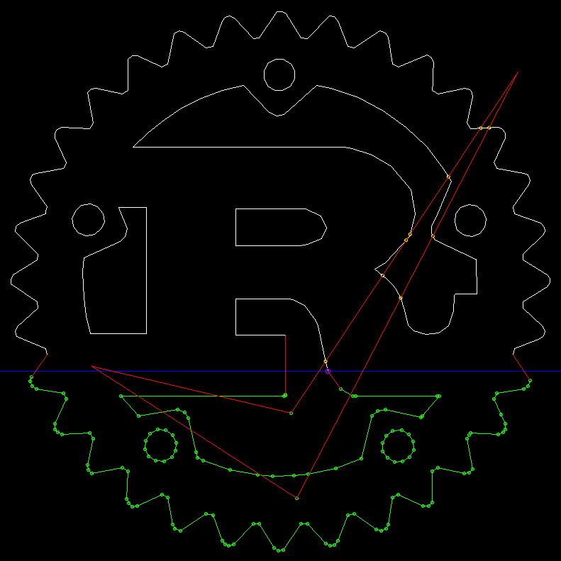

[](https://crates.io/crates/intersect2d)
[](https://docs.rs/intersect2d)
[](https://github.com/eadf/intersect2d.rs/workflows/Rust/badge.svg)
[](https://github.com/eadf/intersect2d.rs/workflows/Clippy/badge.svg)
[](https://deps.rs/crate/intersect2d/0.4.1)

# intersect2d
After watching [Philipp Kindermann's](https://www.youtube.com/watch?v=I9EsN2DTnN8) excellent sweep-line 
videos I think I finally understand how this algorithm works.

This is my humble take on an implementation of the segment line 
intersection sweep-line algorithm.
\
\
The library crate also contains a [line intersection function](https://stackoverflow.com/a/565282).

Code still in development, not ready for any purpose.



Interactive step-by-step example:
```fish
cargo run --example fltk_gui --features console_trace
```

Most of this crate have been adapted for [nalgebra](https://crates.io/crates/nalgebra), 
[cgmath](https://crates.io/crates/cgmath), [mint](https://crates.io/crates/mint) and plain vector [here](https://crates.io/crates/linestring).

Intersection function API example:
```rust
use intersection2d::{intersect, Intersection};
use geo;

let line1:geo::Line::<f64> = [(100.0,150.),(150.0,100.)].into();
let line2:geo::Line::<f64> = [(100.0,150.),(150.0,100.)].into();

let _rv = intersect(&line1, &line2);
match _rv {
    Some(Intersection::Intersection(_a)) => panic!("expected an overlap"),
    Some(Intersection::OverLap(a)) => println!("{:?}", a),
    None =>  panic!("expected an overlap"),
}
// you can also get a single intersection point from the Intersection enum.
// Albeit geometrically incorrect, it makes things easy
if let Some(_rv) =_rv {
    println!("{:?}", _rv.single());
}
```

Sweep-line API example:
```rust
use geo;
use intersect2d::algorithm::AlgorithmData;

let _l = vec![
    geo::Line::new(
        geo::Coordinate { x: 200., y: 200. },
        geo::Coordinate { x: 350., y: 300. },
    ),
    geo::Line::new(
        geo::Coordinate { x: 400., y: 200. },
        geo::Coordinate { x: 250., y: 300. },
    ),
];
let results = AlgorithmData::<f64>::default()
    .with_ignore_end_point_intersections(false)?
    .with_lines(_l.into_iter())?
    .compute()?;
for (p, l) in results.iter() {
    println!("Intersection @{:?} Involved lines:{:?}", p, l);
}
```

Detection of self-intersecting geo::LineString:
```rust
let coordinates = vec![(200., 200.), (300., 300.), (400., 200.), (200., 300.)];
let line_string = geo::LineString::from(coordinates);

// Obviously this example only makes sense for LinesStrings with many points.
// A simple brute force O(n²) intersection test will be faster than this O(nlog(n)+k) 
// sweep-line algorithm if n is small enough.  
let result = AlgorithmData::<f32>::default()
    .with_ignore_end_point_intersections(true)?
    .with_stop_at_first_intersection(true)?
    .with_lines(line_string.lines())?
    .compute()?;
for (p, l) in result.iter() {
    println!("Intersection detected @{:?} Involved lines:{:?}", p, l);
}
```
or using the `SelfIntersectingExclusive` trait:
```rust
// SelfIntersectingExclusive does not report endpoint intersections
use intersect2d::SelfIntersectingExclusive;

let coordinates = vec![(200., 200.), (300., 300.), (400., 200.), (200., 300.)];
let line_string = geo::LineString::from(coordinates);

if line_string.is_self_intersecting()? {
    println!("Intersection detected");
}

for intersections in line_string.self_intersections()? {
    println!("Intersection: {:?}", intersections);
}
```

You can also check a bunch of `geo::Line` for self intersections using the `SelfIntersectingInclusive` trait:
```rust
// SelfIntersectingInclusive reports endpoint intersections
use intersect2d::SelfIntersectingInclusive;
let lines = vec![
    geo::Line::new(
        geo::Coordinate { x: 200., y: 200. },
        geo::Coordinate { x: 350., y: 300. },
    ),
    geo::Line::new(
        geo::Coordinate { x: 400., y: 200. },
        geo::Coordinate { x: 250., y: 300. },
    ),
];
if lines.is_self_intersecting_inclusive()? {
    println!("Intersection detected");
}
for intersections in lines.self_intersections_inclusive()? {
    println!("Intersection: {:?}", intersections);
}
```

## Todo
- [x] Error handling
- [ ] Benchmark and optimize
- [ ] Stable overlapping co-linear line detection

